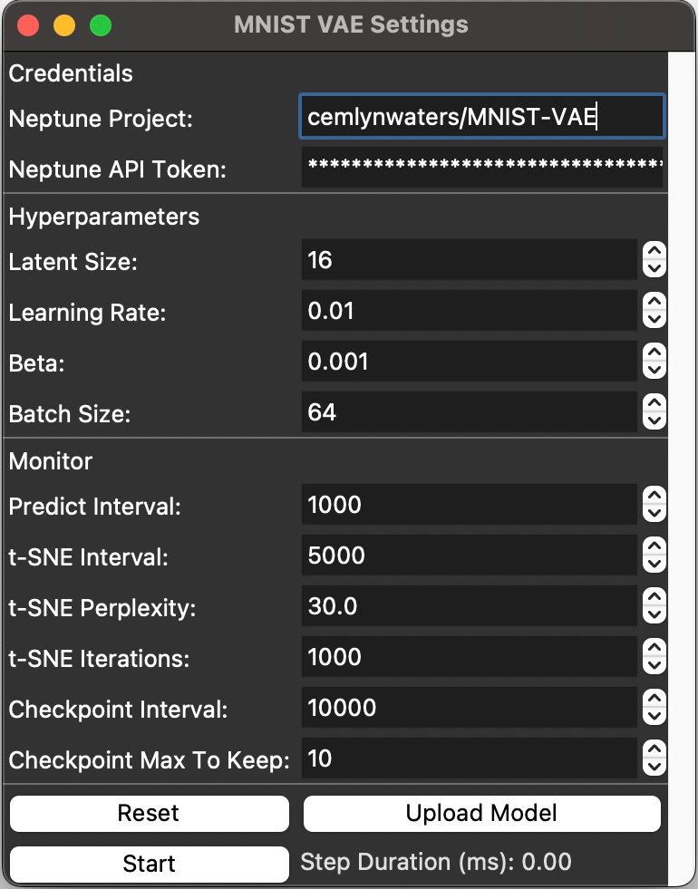

# MNIST-VAE Application
This project allows users to train a variational autoencoder (VAE) on the MNIST dataset. In particular the user can upload their own JAX Flax model and train it on the MNIST dataset. The user can dynamically adjust hyperparameters and see the results of the training in real time as all metrics and images are uploaded to Neptune.

<style>
    .screenshot {
        width: 450px;
        height: auto;
    }

    @media only screen and (max-width: 600px) {
        .screenshot {
            width: 80vw;
        }
    }
</style>

<p align="center">
  
</p>

## Getting Started
* You can run this application like an old Python package by pip installing the source code or by running the built MacOS or Linux app.
* You will need to create a [Neptune](https://neptune.ai) account, it is free!
* When running the app, you will need to upload a Flax model to train on the MNIST dataset. You can find some examples folder in `mnist_vae`.
* Adjust the parameters and click start, your browser should automatically open a tab/window to the Neptune dashboard where you can see the results of your training.

## Why did I make this project?
I created this project because I wanted to learn the following:
* How to package a Python application for MacOS and Linux whilst still being able to use JAX accelerators
* How would I need to organise my code to be able to dynamically change settings at runtime and see the results in real time
* How to write Flax models


# Installation the Application
## From Source

After setting up your Python virtual environment, if you are on Linux you will want to use apt to install snapcraft, then you can build the application by running the following command:
```
python tools/build_app.py
```
You should then see on MacOS the MNIST-VAE.app in `/tmp/mnist-vae/dist` or on Linux see in the snap folder relative to the project root, the file will be called something like `mnist-*amd64.snap`.

## MacOS ARM64
After downloading and unzipping the MNIST-VAE.zip, you should be able to run the app by double-clicking on the MNIST-VAE.app file.  If you get an error message about the app being from an unidentified developer, you can click Open or if you don't feel comfortable, build the application from source! You will then be given the option to open the app and you can using it.

If you want to, in finder you can drag the MNIST-VAE.app into the Applications folder, this way you can find the MNIST-VAE app in Launchpad.

## Linux x86_64 for CPU or CUDA 12
Don't forget to copy the archived app into a folder called local-source.
When developing, install using something like:
```
sudo snap install --devmode mnist-vae_*_amd64.snap
```
When installing for production use:
```
snap install --dangerous mnist-vae_*_amd64.snap
snap connect mnist-vae:password-manager-service
snap connect mnist-vae:hardware-observe
```
Note that `--dangerous` is used because the snap has not been signed.
Uninstall using:
```
sudo snap remove --purge mnist-vae
```
Resources:
* https://snapcraft.io/docs/desktop-menu-support#:~:text=Desktop%20entry%20files%20in%20the%20%60snap%2Fgui%60%20directory&text=The%20desktop%20file%20and%20icon,name%3A%20entry%20in%20the%20snapcraft.
* https://snapcraft.io/docs/dump-plugin?_ga=2.80243987.502937871.1698610500-1953973932.1646255773
* https://ubuntu.com/tutorials/create-your-first-snap
